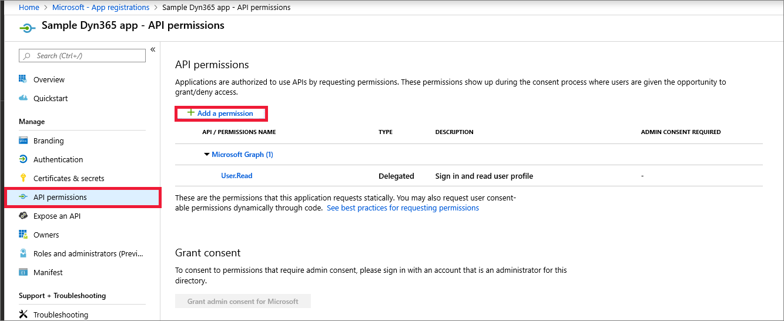

# Company Communicator App Engine Template

This repo utilizes the core functionality of [Company Communicator](https://github.com/OfficeDev/microsoft-teams-apps-company-communicator) with a focus on sending adaptive card content via a web api.


## Deployment

##### 1. Fork this repository

To deploy the application you will need to modify the workflows provided in this repository filling the parameter values with your environment details. So you will need to fork this repository to be able to modify the workflows to match your environment.

Note: A fork is a copy of a repository. Forking a repository allows you to freely experiment with changes without affecting the original project.

You can fork this repository by clicking on the Fork button in the upper right corner of this page.


##### 2. Configure deployment credentials:
 
- Define a new secret under your repository settings, Add secret menu
  
- Store the output of the below az cli command as the value of secret variable name the secrt 'AZURE_CREDENTIALS'

``` 
az ad sp create-for-rbac --name "github-deployment" --role contributor \
                            --scopes /subscriptions/{subscription-id} \
                            --sdk-auth
                            
  # Replace {subscription-id}, {resource-group} with the subscription, resource group details

  # The command should output a JSON object similar to this:

 
  {
    "clientId": "<GUID>",
    "clientSecret": "<STRING>",
    "subscriptionId": "<GUID>",
    "tenantId": "<GUID>",
    "resourceManagerEndpointUrl": "<URL>"
    (...)
  } 
  ```

##### Manually creating the Credentials object
If you already created and assigned a Service Principal in Azure you can manually create the .json object above by finding the `clientId`and `clientSecret` on the Service Principal, and your `subscriptionId` and `tenantId` of the subscription and tenant respectively. The resourceManagerEndpointUrl will be https://management.azure.com/ if you are using the public Azure cloud.

##### Assign additional permissions
The created service principal needs additional permissions so it can assign roles to the various App Registrations that need to be created.

1. Sign in to the [Azure portal](https://portal.azure.com/).

2. If you have access to multiple tenants, use the Directories + subscriptions filter  in the top menu to switch to the tenant in which you want to register the application.

3. Search for and select Azure Active Directory.

4. Under Manage, select App registrations, use the search field to select the service principal created for deployment.


5. Select API permissions tab, click on Add a permission.



6. Select "Microsoft Graph" and then choose "Application Permissions", Search for "RoleManagement" and select the "RoleManagement.ReadWrite.Directory" permission.


7. Grant admin consent for the added permissions.


### Run the GitHub Actions workflow. 

1. On GitHub.com, navigate to the main page of the repository.

2. Under your repository name, click  Actions.

3. In the left sidebar, click the workflow "Deploy CC Engine Infrastructure".

4. Select the "Run Workflow" button and update the avaiable properties to reflect your installation details.

### API Usage


## Legal notice

This app template is provided under the [MIT License](https://github.com/OfficeDev/microsoft-teams-company-communicator-app/blob/main/LICENSE) terms.  In addition to these terms, by using this app template you agree to the following:

- You, not Microsoft, will license the use of your app to users or organization. 

- This app template is not intended to substitute your own regulatory due diligence or make you or your app compliant with respect to any applicable regulations, including but not limited to privacy, healthcare, employment, or financial regulations.

- You are responsible for complying with all applicable privacy and security regulations including those related to use, collection and handling of any personal data by your app. This includes complying with all internal privacy and security policies of your organization if your app is developed to be sideloaded internally within your organization. Where applicable, you may be responsible for data related incidents or data subject requests for data collected through your app.

- Any trademarks or registered trademarks of Microsoft in the United States and/or other countries and logos included in this repository are the property of Microsoft, and the license for this project does not grant you rights to use any Microsoft names, logos or trademarks outside of this repository. Microsoft’s general trademark guidelines can be found [here](https://www.microsoft.com/en-us/legal/intellectualproperty/trademarks/usage/general.aspx).

- If the app template enables access to any Microsoft Internet-based services (e.g., Office365), use of those services will be subject to the separately-provided terms of use. In such cases, Microsoft may collect telemetry data related to app template usage and operation. Use and handling of telemetry data will be performed in accordance with such terms of use.

- Use of this template does not guarantee acceptance of your app to the Teams app store. To make this app available in the Teams app store, you will have to comply with the [submission and validation process](https://docs.microsoft.com/en-us/microsoftteams/platform/concepts/deploy-and-publish/appsource/publish), and all associated requirements such as including your own privacy statement and terms of use for your app.

## Contributing

This project welcomes contributions and suggestions.  Most contributions require you to agree to a
Contributor License Agreement (CLA) declaring that you have the right to, and actually do, grant us
the rights to use your contribution. For details, visit https://cla.microsoft.com.

When you submit a pull request, a CLA-bot will automatically determine whether you need to provide
a CLA and decorate the PR appropriately (e.g., label, comment). Simply follow the instructions
provided by the bot. You will only need to do this once across all repos using our CLA.

This project has adopted the [Microsoft Open Source Code of Conduct](https://opensource.microsoft.com/codeofconduct/).
For more information see the [Code of Conduct FAQ](https://opensource.microsoft.com/codeofconduct/faq/) or
contact [opencode@microsoft.com](mailto:opencode@microsoft.com) with any additional questions or comments.
